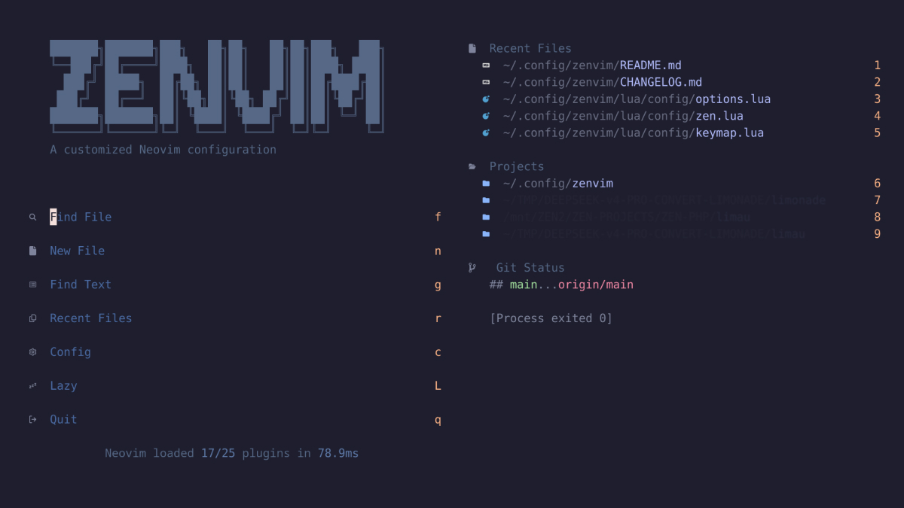

# ZENVIM - Minimal Neovim Configuration



[](https://neovim.io)
[](LICENSE)

A minimal yet powerful Neovim configuration targeting **Neovim v0.12+**.
This configuration focuses on clean organization, modern features, and excellent performance.

## Features

- **Modern Neovim** - Built for Neovim v0.12+ with latest features
- **Lazy.nvim** - Fast, modern plugin manager
- **LSP Support** - Full Language Server Protocol with Mason
- **Treesitter** - Advanced syntax highlighting and code understanding
- **Intelligent Completion** - Blink.cmp with LSP integration
- **Beautiful UI** - Custom themes, status line, and visual enhancements
- **File Management** - Yazi file manager and integrated explorer
- **Git Integration** - Lazygit, gitsigns, and comprehensive git workflow
- **Performance** - Optimized for speed and responsiveness
- **Zen Mode** - Distraction-free writing environment
- **Highly Configurable** - Easy to extend and customize

---

## Quick Start

### Prerequisites

- **Neovim v0.12++** - [Installation Guide](https://github.com/neovim/neovim/wiki/Installing-Neovim)
- **Git** - For plugin management and version control
- [**Nerd Font**](https://www.nerdfonts.com/) (Optional but recommended) - For better UI icons

### Installation

Two installation options provided.

#### Side installation **(recommended)**

This version does not change the default `nvim` installation or your configurations in `~/.config/nvim`,
because the `zenvim` configuration is installed in **`~/.config/zenvim`**.

<br>

1. **Clone `zenvim` configuration**:

   ```bash
   git clone https://github.com/kematzy/zenvim.git ~/.config/zenvim
   ```

2. **Create the `zenvim` alias** (since plain `nvim` would load `~/.config/nvim`, not this config):

   Bash users

   ```bash
   echo 'alias zenvim="NVIM_APPNAME=zenvim nvim"' >> ~/.bashrc
   ```

   Zsh users

   ```bash
   echo 'alias zenvim="NVIM_APPNAME=zenvim nvim"' >> ~/.zshrc
   ```

   Reload your shell (`source ~/.bashrc` or `source ~/.zshrc`) after adding the alias.

3. **Start ZENVIM**:

   ```bash
   zenvim
   ```

4. **Wait for plugins to install** - Lazy.nvim will automatically install all required plugins on first launch.

---

#### Replace default `nvim` installation **(be careful & know what you are doing)**

These instructions replace the default `nvim` installation and any custom configurations you may
have done.

1. **Backup your existing configuration** (if you have one):

   ```bash
   mv ~/.config/nvim ~/.config/nvim.backup
   mv ~/.local/share/nvim ~/.local/share/nvim.backup
   ```

2. **Clone the configuration**:

   ```bash
   git clone https://github.com/kematzy/zenvim.git ~/.config/nvim
   ```

3. **Start NVIM**:

   ```bash
   nvim
   ```

4. **Wait for plugins to install** - Lazy.nvim will automatically install all required plugins on first launch.

### First Launch

The first time you start Neovim, Lazy.nvim will:

- Install all configured plugins
- Set up LSP servers automatically
- Install Treesitter parsers
- Create necessary configuration files

---

## Project Structure

```
├── init.lua                    # Main entry point
├── README.md                   # This file
├── AGENTS.md                   # Guidance for coding agents
├── CONTRIBUTING.md             # Contribution guidelines
├── CHANGELOG.md                # Version history
├── LICENSE                     # MIT license
├── Makefile                    # `make check`, `make format`
├── cspell.json                 # Spell-check dictionary
├── lazy-lock.json              # Plugin version lockfile
├── stylua.toml                 # Lua formatter configuration
├── .editorconfig               # Editor configuration
├── .gitignore                  # Git ignore rules
├── .luacheckrc                 # Lua linter configuration
├── .luarc.json                 # Lua Language Server configuration
├── scripts/
│   └── check.sh                # Local quality gates
├── lua/
│   ├── config/                 # Core configuration
│   │   ├── globals.lua         # Global variables and settings
│   │   ├── options.lua         # Editor options
│   │   ├── keymap.lua          # Keybinding definitions
│   │   ├── autocmd.lua         # Autocommands
│   │   ├── lazy.lua            # Lazy.nvim bootstrap
│   │   ├── health.lua          # :ZENVIMHealth check
│   │   └── zen.lua             # Palette for lualine / terminal chrome
│   └── plugins/                # Plugin specifications
│       ├── colorscheme.lua     # Catppuccin theme
│       ├── completion.lua      # Blink.cmp completion
│       ├── editor.lua          # Editor enhancements
│       ├── formatting.lua      # Conform (format-on-save)
│       ├── lazydocker.lua      # LazyDocker UI
│       ├── lsp.lua             # LSP attach, diagnostics, ensure_installed
│       ├── lualine.lua         # Status line
│       ├── mason.lua           # Mason + formatter/linter tools
│       ├── performance.lua     # Performance tweaks
│       ├── snacks.lua          # Snacks.nvim configuration
│       ├── terminal.lua        # Integrated terminal
│       ├── treesitter.lua      # Syntax highlighting
│       ├── trouble.lua         # Diagnostics list
│       ├── ui.lua              # UI enhancements
│       └── yazi.lua            # Yazi file manager
└── snippets/                   # VSCode-format snippets
    └── package.json            # Snippet manifest
```

---

## Language Support

LSP support is configured for:

- **Web**: HTML, CSS, JavaScript/TypeScript, JSON, YAML, TOML
- **Backend**: Lua, Python, Go, PHP, Ruby, Bash
- **DevOps**: Docker, SQL
- **Markup**: Markdown
- **Templates**: Slim, ERB, Handlebars

---

## Keybindings

This configuration includes comprehensive keybindings. `<leader>` is the `<Space>` key.

### Navigation & Files

- `<leader>e` - Toggle file explorer
- `<leader>ff` - Find files
- `<leader>fc` - Find config file
- `<leader>fg` - Live grep
- `<leader>fG` - Find git files
- `<leader>fb` - Browse buffers
- `<leader>fp` - Projects
- `<leader>fr` - Recent files
- `<leader>bd` - Delete buffer
- `<leader>cR` - Rename file

### LSP

- `gd` - Go to definition
- `gr` - Go to references
- `gI` - Go to implementation
- `gD` - Go to declaration
- `<leader>D` - Type definition
- `<leader>ds` - Document symbols
- `<leader>ws` - Workspace symbols
- `<leader>cr` - Rename symbol
- `<leader>ca` - Code actions
- `<C-k>` - Signature help (in insert mode)

### Git

- `<leader>gg` - Open LazyGit
- `<leader>gb` - Git blame line
- `<leader>gB` - Git branches
- `<leader>gl` - Git log
- `<leader>gL` - Git log for current line
- `<leader>gs` - Git status
- `<leader>gS` - Git stash
- `<leader>gd` - Git diff (hunks)
- `<leader>gF` - Git log for current file

### Search

- `<leader>sc` - Command history
- `<leader>sC` - Search commands
- `<leader>sh` - Search help pages
- `<leader>sH` - Search highlights
- `<leader>si` - Search icons
- `<leader>sk` - Search keymaps
- `<leader>sm` - Search marks
- `<leader>sM` - Search man pages
- `<leader>s/` - Search history
- `<leader>sp` - Search plugin spec
- `<leader>sq` - Quickfix list
- `<leader>sR` - Resume search
- `<leader>su` - Undo history
- `<leader>sa` - Search autocommands
- `<leader>s"` - Search registers
- `<leader>sd` - Search diagnostics
- `<leader>sD` - Search buffer diagnostics
- `<leader>sj` - Search jumps
- `<leader>sl` - Search location list

### Diagnostics & Trouble

- `[d` - Previous diagnostic
- `]d` - Next diagnostic
- `<leader>xq` - Diagnostic location list
- `<leader>xx` - Diagnostics (Trouble)
- `<leader>xX` - Buffer diagnostics (Trouble)
- `<leader>cs` - Symbols (Trouble)
- `<leader>cl` - LSP definitions/references (Trouble)
- `<leader>xL` - Location list (Trouble)
- `<leader>xQ` - Quickfix list (Trouble)

### Terminal & Tools

- `<leader>tt` - Floating terminal
- `<leader>td` - LazyDocker
- `<leader>tg` - LazyGit
- `<leader>ty` - Yazi (current file)
- `<leader>tY` - Yazi (working directory)
- `<leader>t.` - Resume Yazi session

### Windows

- `<C-h>` / `<C-j>` / `<C-k>` / `<C-l>` - Move between windows
- `<C-Up>` / `<C-Down>` - Adjust window height
- `<C-Left>` / `<C-Right>` - Adjust window width

### Editor

- `<C-s>` - Save file
- `<C-q>` - Quit Neovim
- `<Esc>` - Clear search highlighting
- `<A-j>` / `<A-k>` - Move line/selection down/up
- `<` / `>` - Indent and reselect (visual mode)
- `<C-/>` - Toggle comment
- `<leader>cf` - Format buffer
- `<leader>z` - Toggle Zen mode
- `<leader>Z` - Toggle zoom
- `<leader>uC` - Change colorscheme
- `<leader>un` - Dismiss all notifications
- `<leader>.` - Toggle scratch buffer
- `<leader>S` - Select scratch buffer
- `<leader>n` - Notification history

See `lua/config/keymap.lua` for the complete keymap list.

---

## Plugin Highlights

- **Snacks.nvim** - Modern, feature-rich plugin collection
- **Blink.cmp** - Fast completion engine
- **Mason.nvim** - LSP server management
- **Yazi.nvim** - Modern file manager
- **Gitsigns.nvim** - Git signs and integration
- **LazyGit.nvim** - Git UI inside Neovim
- **Conform.nvim** - Code formatting
- **Lualine.nvim** - Status line
- **Treesitter** - Syntax highlighting and code understanding

---

## Customization

### Adding New LSP Servers

Edit `lua/plugins/lsp.lua` and add to the `servers` table:

```lua
local servers = {
   -- existing servers...
   rust_analyzer = {},  -- Add Rust support
   clangd = {},         -- Add C/C++ support
}
```

### Adding Plugins

Create new files in `lua/plugins/` or add to existing ones:

```lua
-- lua/plugins/your-plugin.lua
return {
   "username/plugin-name",
   config = function()
      -- Plugin configuration
   end,
}
```

### Custom Keymaps

Add to `lua/config/keymap.lua`:

```lua
M.global = {
   { "<leader>h", "<cmd>echo 'Hello'<cr>", desc = "Say hello" },
   -- Add more keymaps...
}
```

## Troubleshooting

### Common Issues

1. **Plugin Installation Errors**:

   ```vim
   :Lazy health
   ```

2. **LSP Server Issues**:

   ```vim
   :Mason
   :LspInfo
   ```

3. **Keymap Conflicts**:

   ```vim
   :verbose map <key>
   ```

4. **Performance Issues**:

   ```vim
   :checkhealth
   ```

5. **ZENVIM Health Check**:

   ```vim
   :ZENVIMHealth
   ```

6. **Startup Performance**:
   ```vim
   :StartupTime
   ```

### Getting Help

- Check `:help` for Neovim documentation
- Review plugin documentation with `:help plugin-name`
- Use `:checkhealth` for system diagnostics

## Documentation

- [AGENTS.md](AGENTS.md) - Architecture and commands for coding agents
- [Contributing Guide](CONTRIBUTING.md) - How to contribute to this project
- [Changelog](CHANGELOG.md) - Version history and changes
- [Neovim Documentation](https://neovim.io/doc/)
- [Lazy.nvim Documentation](https://github.com/folke/lazy.nvim)

## Contributing

Contributions are welcome! Please read the [Contributing Guide](CONTRIBUTING.md) for details on:

- Code style and conventions
- Plugin management
- Testing procedures
- Submitting changes

## License

This project is licensed under the MIT License - see the [LICENSE](LICENSE) file for details.

## Acknowledgments

This configuration was created with assistance from:

- Claude Sonnet v4
- Grok 3 & 4.6

And the amazing Neovim community and plugin authors who make this possible.

---

**Happy coding!**

If you find this configuration helpful, please consider giving it a ⭐ star!
